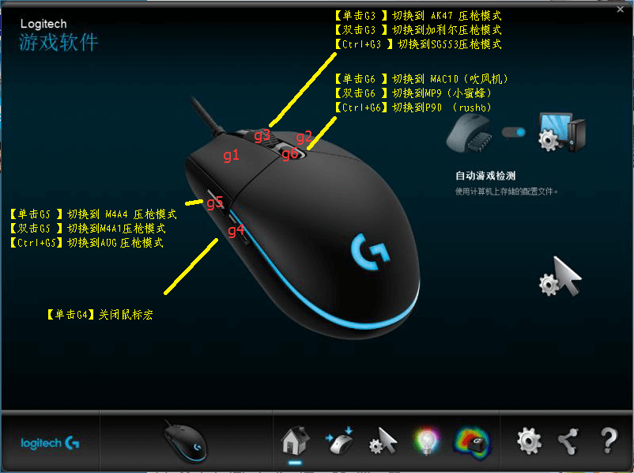
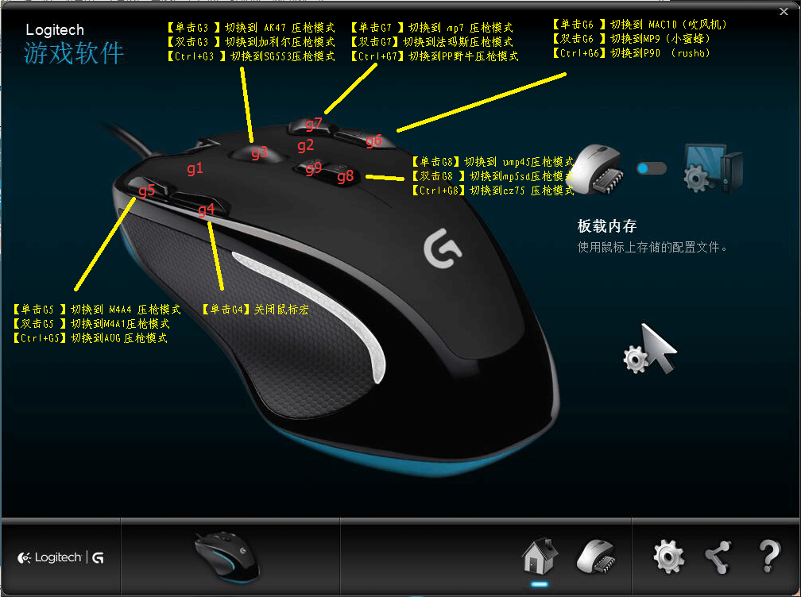
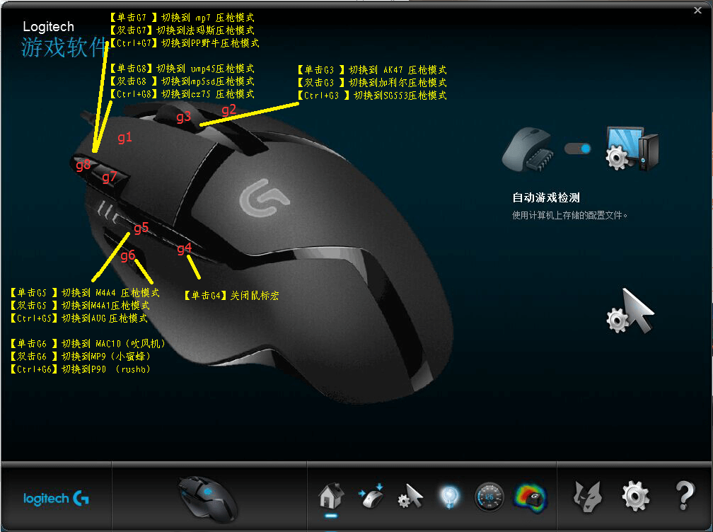
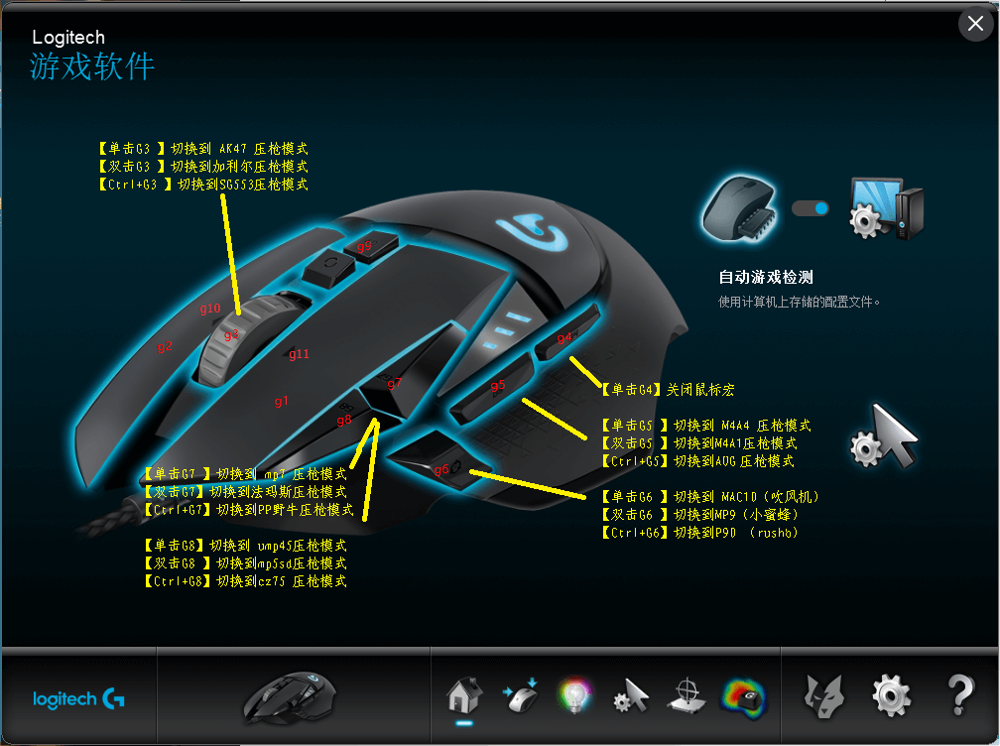
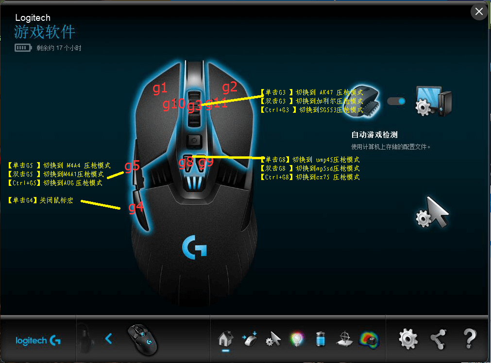
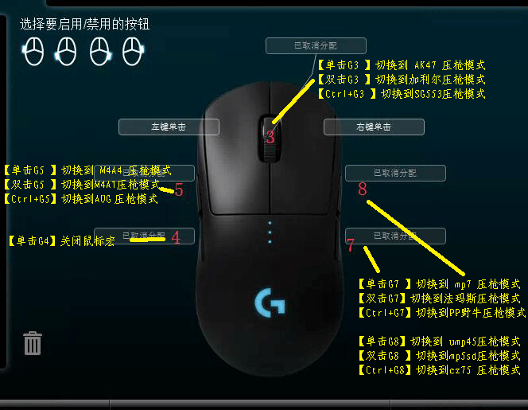

# 罗技鼠标按键编号图

## G102/G302/G304/G703/G403 按键图

## G300S 按键图

## G402 按键图

## G502 按键图

## G900 按键图

## G Pro 按键图

## 使用说明
1. 根据你的鼠标型号查看对应的按键编号图
2. 在脚本中配置武器切换按键时，使用图中标注的按键编号
3. 不同鼠标型号的按键编号可能不同，请务必使用正确的编号