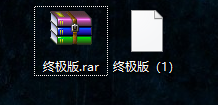
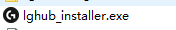
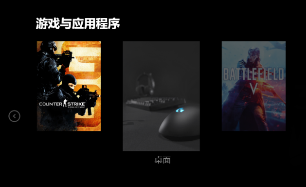
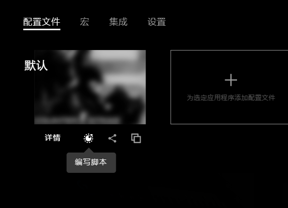
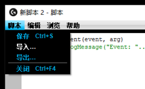
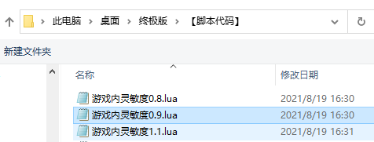
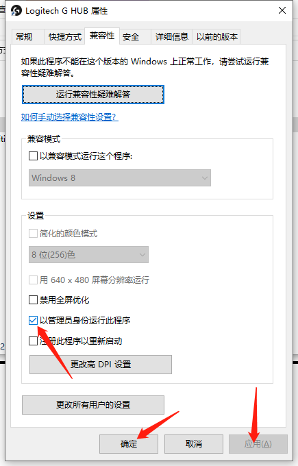

# Instruction Manual

[**English**](../README.md) | [**中文**](../README_CN.md) | [Button Reference](Must-see%20Button%20Diagram_EN.md) | [5E Platform Guide](5E%20Cannot%20Use%20Tutorial_EN.md)

---

## 1. Extract Files
Extract the files to your desktop. If you see the file icon shown on the right, please install extraction software first (e.g., WinRAR, 7-Zip).

## 2. Install Logitech Driver
If you have already installed it, skip this step. If not, the installer is included in the extracted files - click to install.

## 3. Import Script and Test
### Select CSGO/CS2 Game

### Click "Script Editor" at the bottom left

### Click Import

### Select the Appropriate Script

### Click Import to Complete
【At this point, by referring to the Button Reference Guide in the folder, clicking the corresponding side button on your mouse will show a prompt at the bottom of the script editor. Place your mouse on the desk, hold the fire button, and the mouse will move automatically.】

## 4. Set Administrator Mode
### Set GHUB to run in administrator mode, then restart GHUB to use normally
